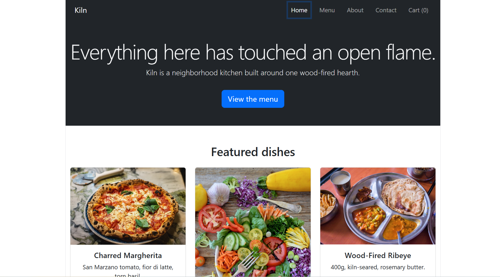
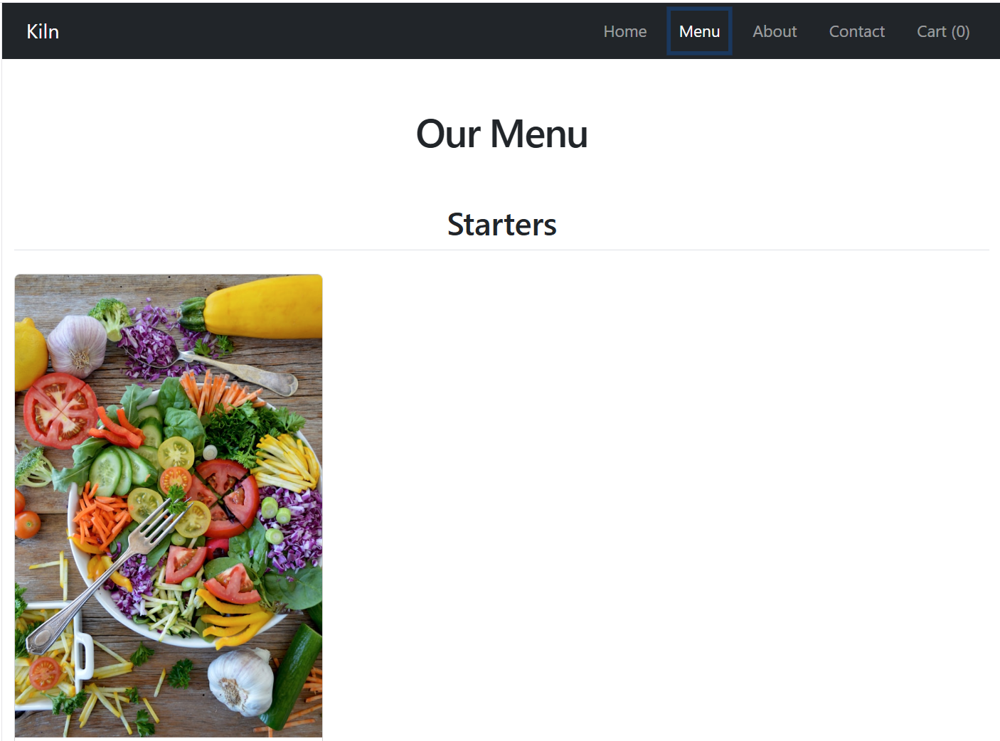
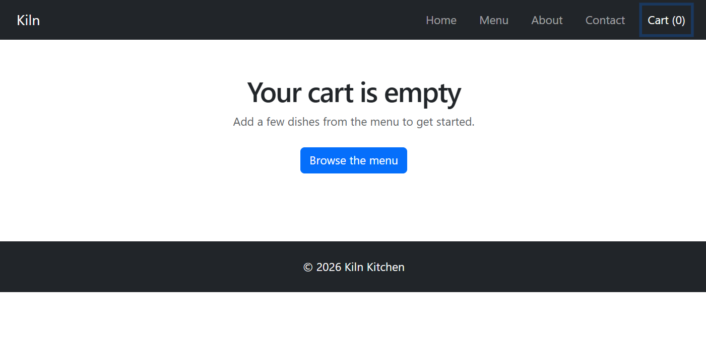
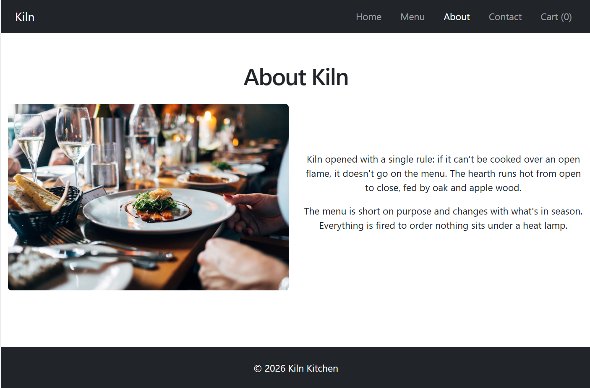
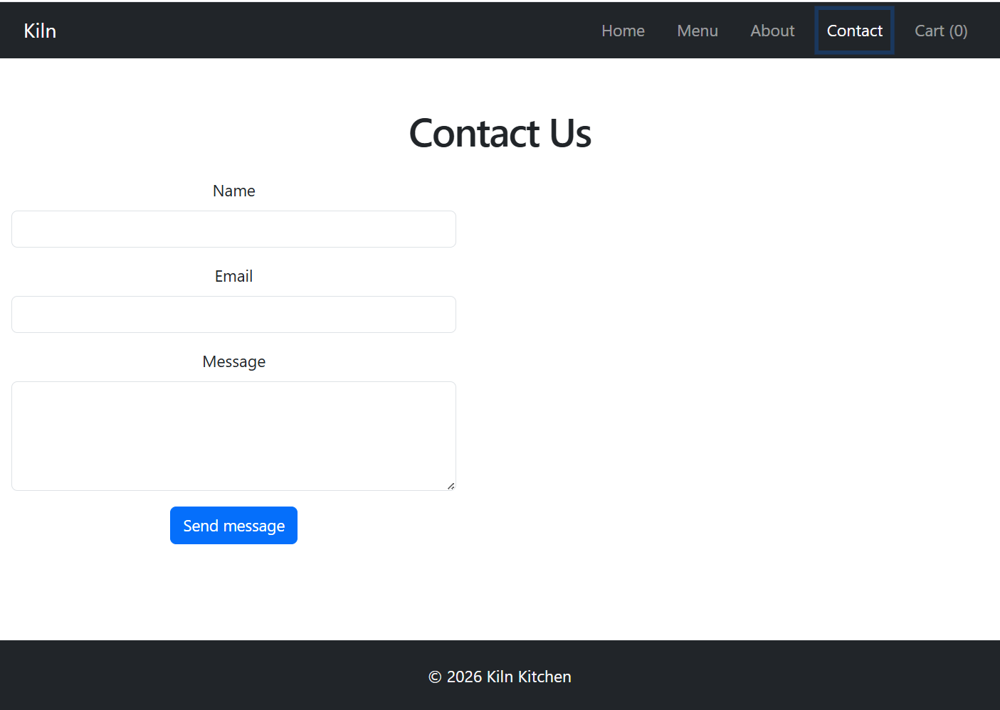

# Kiln — Restaurant Ordering System

A frontend web app for a fictional wood-fired restaurant. Built for CSCI426
Advanced Web Programming, Phase 1.

## Live demo

https://kiln-restaurant.vercel.app

## Project description

Kiln lets a visitor browse the restaurant's menu by category, add dishes to
a cart, adjust quantities, and place a simulated order. This is the Phase 1
submission — frontend only, built with React and Bootstrap. No backend or
database exists yet; that comes in Phase 2.

## Pages

- **Home** — hero section + featured dishes
- **Menu** — full menu grouped by category, with "Add to cart" buttons
- **Cart** — the dynamic page; shows cart items, lets you adjust quantities,
  remove items, and see the running total
- **About** — restaurant story
- **Contact** — contact form

## Tech stack

- React (Vite)
- React Router
- Bootstrap
- React Context (for cart state)

## Setup instructions

\`\`\`bash
npm install
npm run dev
\`\`\`

Then open the local URL shown in your terminal (usually `http://localhost:5173`).

## Screenshots

### Home

### Menu

### Cart

### About

### Contact
